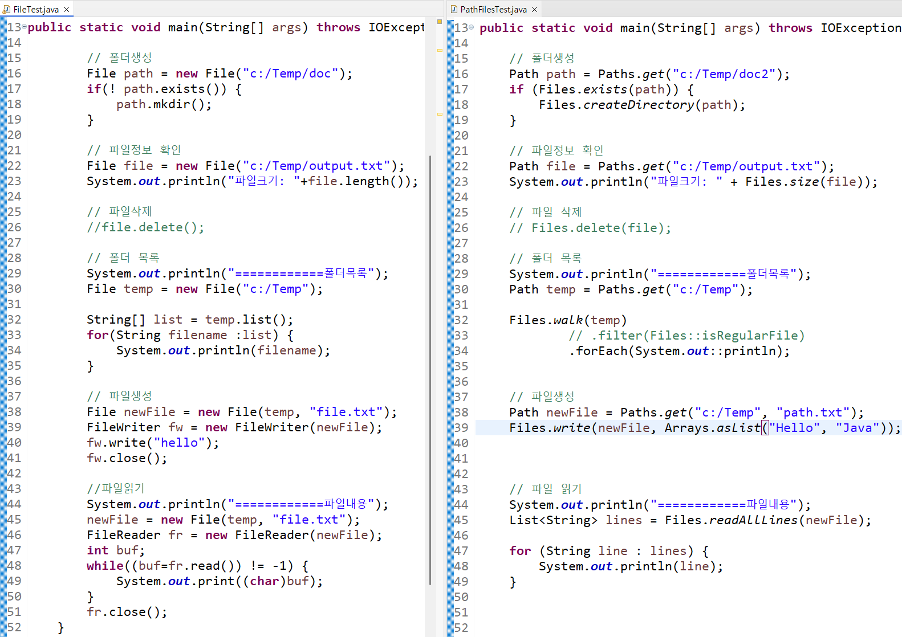

## JAVA API

1. 문자열: String, StringBuffer
2. 날짜: Date, Calendar, LocalDate, LocalTime, Duration
3. 자료구조: List / Set / Map
4. 래퍼클래스 : Integer, Long ...
5. 파일: File, Files, Path, 입출력 스트림

### String

```java
public class StringUtil {
	//문자형 날자에서 년도만 월
	public static String getYear(String date) {
		return date.substring(0, 4);
	}
	public static String getYear(Date date) {
		Calendar calendar = Calendar.getInstance();
		calendar.setTime(date);
		int year = calendar.get(Calendar.YEAR);
		return String.valueOf(year);
	}
	public static String getMonth(String date) {
		return date.substring(4, 6);
	}
}
```

```java
	public static void main(String[] args) {
		String year = StringUtil.getYear(new Date());
		System.out.println(year);
		String month = StringUtil.getMonth("20240408");
		System.out.println(month);
	}
```

### 날짜

```
Date          ---->    calendar     ---->       LocalDate, LocalTime, LocalDateTime, ZonedDateTime, Duration
                                                Instant
SimpleDateFormat                                DateTimeFormatter
                                                java 8 ↑
java.util                                       java.time
```

#### 자바 날짜 타입 비교

| 항목             | java.util(Legacy)                                 | java.time (Java 8+)                                                                                     |
| ---------------- | ------------------------------------------------- | ------------------------------------------------------------------------------------------------------- |
| 날짜/시간 범위   | `Date`: 날짜+시간, `Calendar`: 날짜+시간          | `LocalDate`: 날짜만, `LocalTime`: 시간만, `LocalDateTime`: 날짜+시간, `ZonedDateTime`: 날짜+시간+타임존 |
| 스레드 안전      | X (Thread-unsafe)                                 | O (Thread-safe)                                                                                         |
| 월(Month) 표현   | 0~11 (주의 필요)                                  | 1~12 (직관적)                                                                                           |
| 시간대(Timezone) | Calendar 필요, Date는 UTC로 저장                  | ZonedDateTime으로 명시적 표현 가능                                                                      |
| 날짜/시간 계산   | 복잡, add(), roll() 사용                          | plusDays(), minusMonths(), etc. 직관적                                                                  |
| 포맷팅 / 파싱    | SimpleDateFormat 사용 (Thread-unsafe)             | DateTimeFormatter 사용 (Thread-safe)                                                                    |
| 주요 메서드      | getYear(), getMonth(), getDate(), deprecated 많음 | getYear(), getMonth(), getDayOfMonth(), getHour(), getMinute(), getSecond() 등                          |
| 변환             | Date ↔ Calendar, Date ↔ SQL 타입 변환 필요        | LocalDate ↔ java.sql.Date, LocalDateTime ↔ Timestamp 변환 간단                                          |
| 장점             | 기존 코드 호환성                                  | 직관적, 안전, 연산 용이, 명확한 타입 구분                                                               |
| 단점             | Deprecated 많고 오류 발생 가능                    | 구버전 코드와 호환 필요 시 변환 필요                                                                    |

#### 예시 코드

Legacy 방식  

```java
import java.util.Date;
import java.util.Calendar;

Date now = new Date();
Calendar cal = Calendar.getInstance();
cal.set(2025, Calendar.NOVEMBER, 3);
```
java 8 방식
```java
LocalDate today = LocalDate.now();
LocalDateTime dateTime = LocalDateTime.of(2025, 11, 3, 15, 30);
ZonedDateTime seoulTime = ZonedDateTime.now(ZoneId.of("Asia/Seoul"));
```

시간차이 계산  
```java
        LocalTime start = LocalTime.of(9, 30, 0);  // 09:30:00
        LocalTime end = LocalTime.of(12, 45, 30);  // 12:45:30

        Duration duration = Duration.between(start, end);
        System.out.println("총 시간(hour): " + duration.toHours());
```
### File VS Files/Path

```
파일           경로 / 파일시스템 작업을 수행할 static메서드
File  -------> Path / Files
                 Java 7 ↑
java.io          java.nio

```



### 입출력 스트림
