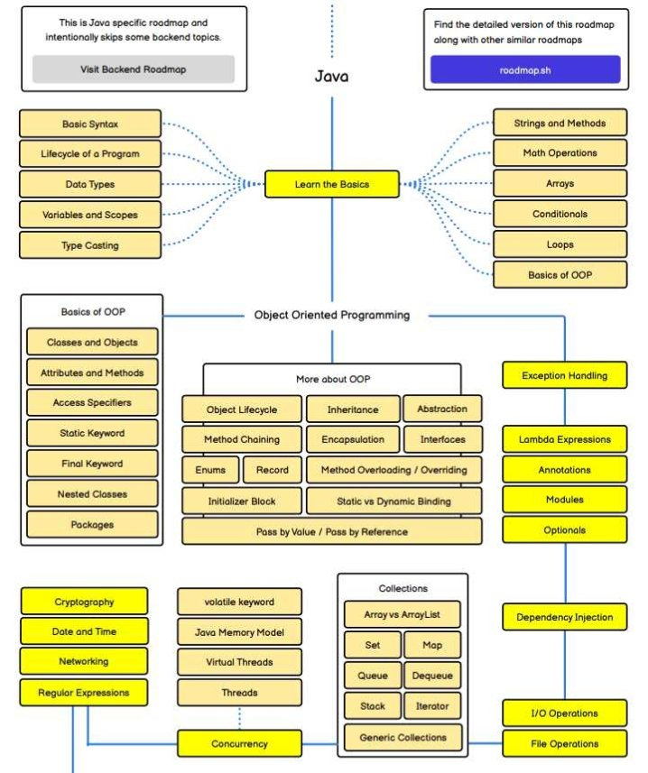
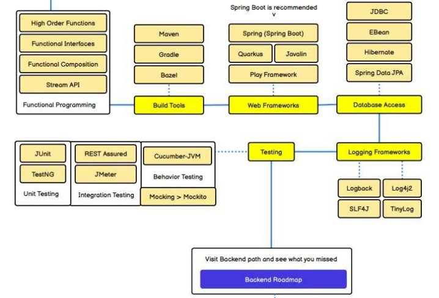
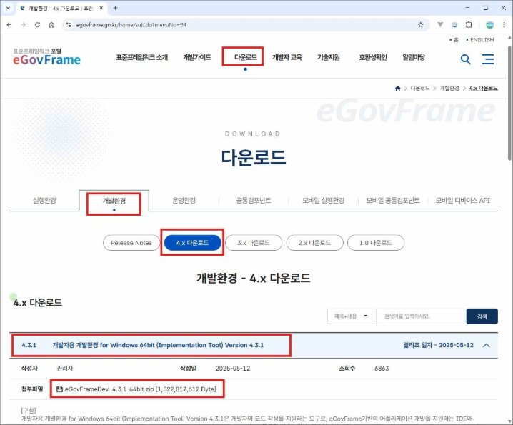

## 수업목표: “자바 로직 사고력 향상”

### 자바 로드맵





### 개발환경 구축

eGovFrame 설치 <https://www.egovframe.go.kr/home/sub.do?menuNo=94>

개발환경을 다운로드(https://www.egovframe.go.kr)하여 설치할 디렉토리(\*\*d:\*\*)에 압 축을 해제한 후 eclipse를 실행하면 개발환경을 사용할 수 있다.



### Pseudo code

슈도코드 = 의사(擬似)코드 = 실제와 비슷함.

프로그램의 논리 흐름을 **자연어**와 **유사**한 형식으로 표현한 것으로, 실제로 실행되지는 않으며 코드를 작성하기 전 단계의 설계 문서.

pseudo code 장점

**알고리즘 설계**: 복잡한 알고리즘의 논리적 흐름을 명확하게 표현하고 설계할 수 있습니다.

**협업**: 개발자 간의 의사소통을 원활하게 해줍니다. 다른 개발자가 의사코드를 보고 프로그램의 작동 방 식을 쉽게 이해할 수 있습니다.

**디버깅 및 문제 해결**: 실제 코딩을 시작하기 전에 논리적 오류를 미리 파악하고 수정하는 데 도움을 줍니다.

**초보자 학습**: 프로그래밍 언어에 익숙하지 않은 사람도 알고리즘의 원리를 쉽게 이해할 수 있도록 도 와줍니다

pseudo code 작성법

- 한 줄에 하나의 동작만 작성한다.
- if, else, while 등 키워드를 활용한다.
- 들여쓰기를 활용(블록 구조를 활용)한다.
- 동작을 명확하게 작성한다.

## 가위바위보 게임

개발목적:

사용자와 컴퓨터가 가위바위보 게임을 하며 승패를 판정하고, 결과를 출력하는 프로그램을 만든다.

요구사항:

1. 숫자 외의 값이 들어오면 “잘못된 입력입니다.” 메시지를 출력하고 다시 입력을 받는다.
1. 사용자가 0을 입력하면 프로그램이 종료된다.
1. 승, 패, 무 횟수를 누적 저장하여 매 경기가 끝날 때마다 결과를 출력한다.

학습 포인트:

`  `조건문, 반복문, 입력 처리

데이터 구조 설계 예시

| 변수명         | 자료형 | 설명                |
| :------------- | :----- | :------------------ |
| winCount       | int    | 사용자의 승리 횟수  |
| loseCount      | int    | 사용자의 패배 횟수  |
| drawCount      | int    | 무승부 횟수         |
| userChoice     | int    | 사용자의 선택 (1~3) |
| computerChoice | int    | 컴퓨터의 선택 (1~3) |

기본 흐름도

```
while
  메뉴 출력
  컴퓨터 선택
  사용자 입력
  print(승,패,무승부)
```

슈도코드

```
[시작]

1. 프로그램 시작 메시지 출력
   "==== 숫자 맞추기 게임 ===="

2. 1~100 사이의 정수를 랜덤으로 하나 선택하여 target 변수에 저장
   target = random(1, 100)

3. 시도 횟수를 저장할 count 변수 초기화
   count = 0

4. 반복 시작 (무한 루프)
   ├─ 사용자로부터 숫자 입력 받기
   print("1~100 사이의 숫자를 입력하세요 (0 입력 시 종료): ")
   guess = 사용자 입력

   ├─ 만약 guess == 0 이면
   print("게임을 종료합니다.")
   반복문 종료

   ├─ 시도 횟수 증가
   count = count + 1

   ├─ 입력값 검증
   if guess < 1 or guess > 100 then
   print("1~100 사이의 숫자만 입력하세요.")
   continue // 다시 입력받기

   ├─ 비교 로직
   if guess == target then
   print("정답입니다! 🎉")
   print("총 시도 횟수:", count, "회")
   반복문 종료
   else if guess < target then
   print("UP! 더 큰 숫자를 입력해보세요.")
   else
   print("DOWN! 더 작은 숫자를 입력해보세요.")

5. 반복 종료 후
   print("게임을 종료합니다. 수고하셨습니다!")

[끝]

```

#### 확장 미션

1. 문자열 입력 버전 ("가위", "바위", "보") ==> 1,2,3 대신에 가위,바위,보를 입력하도록 수정
1. 게임 시작 시 이름을 입력받아 출력
1. 3판 2선승제 시스템 추가
1. 승률 기록 및 랭킹 시스템 저장 (파일 입출력 활용)

## 숫자 맞추기 게임

#### 요구사항

1. 컴퓨터가 1~100 사이의 난수를 하나 생성한다.
1. 사용자는 숫자를 입력하면서 정답을 맞춘다.
1. 컴퓨터는 입력한 숫자가 정답보다 큰지, 작은지, 같은지 알려준다. 사용자가 정답을 맞추면 축하 메시지와 시도 횟수를 출력한다.

#### 프로세스

게임 시작 메시지 출력
랜덤 숫자 생성 (target)
사용자 입력 받기
입력이 숫자가 아님 → 오류 메시지 입력 범위 벗어남 → 오류 메시지 입력값 > target → "Down"
입력값 < target → "Up"
입력값 == target → "정답입니다!" 시도 횟수 출력
재시작 여부 묻기 (선택)

#### 슈도코드

```
 1.	프로그램	시작	메시지	출력
			"====	숫자	맞추기	게임	===="
 2.	1~100	사이의	정수를	랜덤으로	하나	선택하여	target	변수에	저장
			target	=	random(1,	100)
 3.	시도	횟수를	저장할	count	변수	초기화
			count	=	0
 4.	반복	시작	(무한	루프)
			├─	사용자로부터	숫자	입력	받기
								print("1~100	사이의	숫자를	입력하세요	(0	입력	시	종료):	")
								guess	=	사용자	입력
			├─	만약	guess	==	0	이면
								print("게임을	종료합니다.")
								반복문	종료
			├─	시도	횟수	증가
								count	=	count	+	1
			├─	입력값	검증
								if	guess	<	1	or	guess	>	100	then
												print("1~100	사이의	숫자만	입력하세요.")
												continue		//	다시	입력받기
			├─	비교	로직
								if	guess	==	target	then
												print("정답입니다!	￿")
												print("총	시도	횟수:",	count,	"회")
												반복문	종료
								else	if	guess	<	target	then
												print("UP!	더	큰	숫자를	입력해보세요.")
								else
												print("DOWN!	더	작은	숫자를	입력해보세요.")
 5.	반복	종료	후
			print("게임을	종료합니다.	수고하셨습니다!")
 [끝]

```

#### 확장 아이디어

1. 난이도 선택 기능
1. "쉬움(1~50) / 보통(1~100) / 어려움(1~500)" 선택 가능
1. 점수 시스템
1. 시도 횟수에 따라 점수 부여 (예: 10회 이내 정답이면 “천재!”) 재도전 기능
1. 정답 후 “다시 하시겠습니까? (Y/N)” 선택
1. 힌트 기능
1. 5회 이상 실패 시 “10 단위 힌트” 제공 (예: “50~60 사이예요”)
