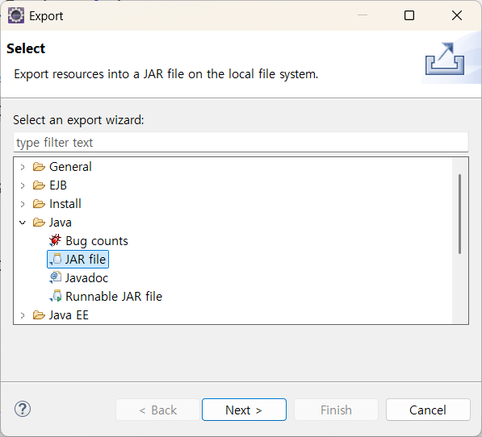
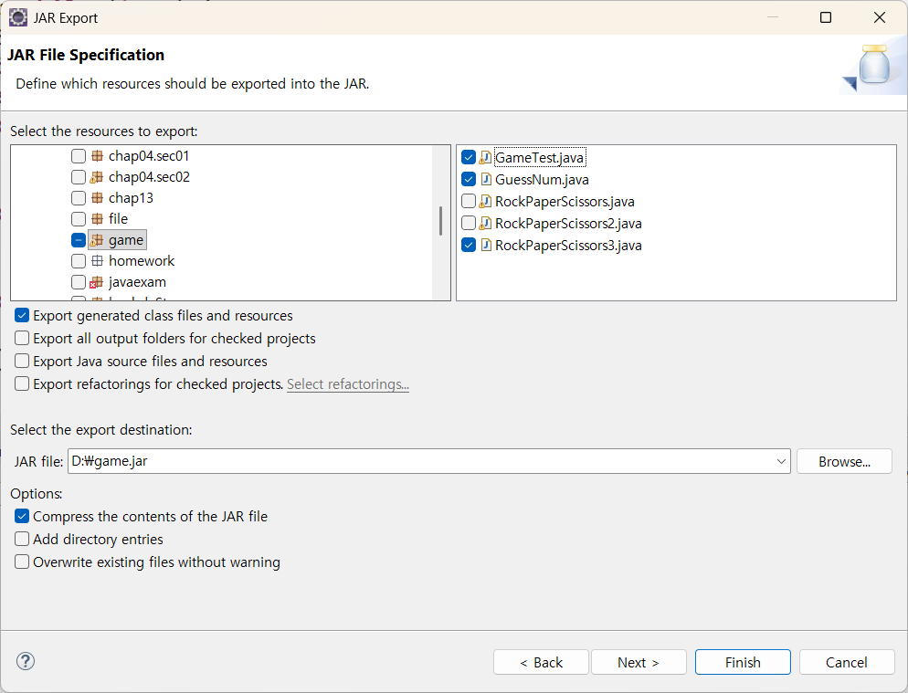
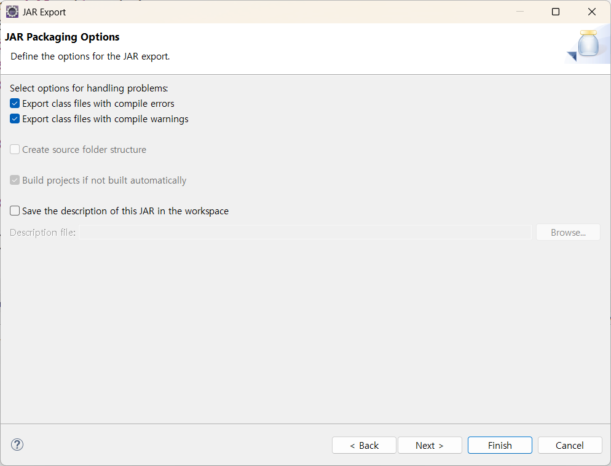
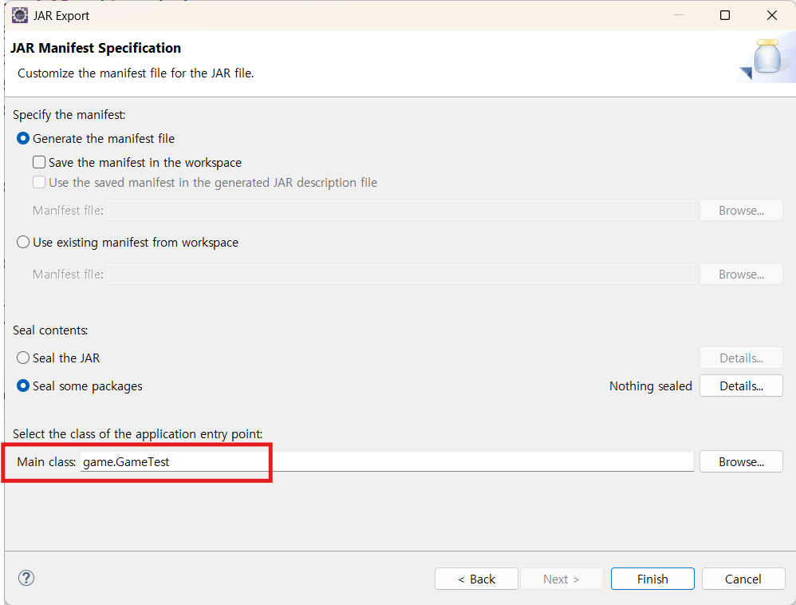
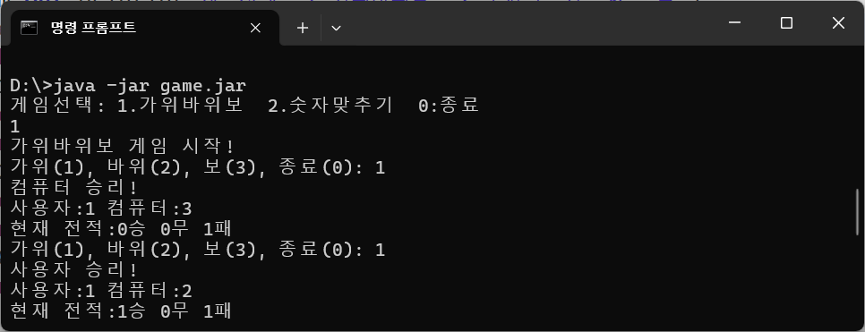

## 객체지향프로그래밍(OOP)

### 수업목표

- 다른 클래스에서 사용(`조립`)할 수 있는 **클래스**로 만들자
  > `객체지향프로그래밍(OOP)`은 만들고자 하는 완성품인 객체를 모델링하고, 집합 관계에 있는 부품객체와 사용 관계에 있는 객체를 하나씩 설계한 후 조립하는 방식으로 프로그램을 개발하는 기법
- **코드 리펙토링(Refactoring)**

  > 코드의 외부 동작을 변경하지 않고 `내부 구조를 개선`하는 소프트웨어 개발 기법
  >
  > - `가독성` 및 유지보수성 향상
  > - 코드가 명확해지고 구조가 단순해지면, 잠재적인 오류나 `버그`를 더 쉽게 발견하고 `예방`

### 클래스 만들기

1. main 메서드 없애기

   ```java
   public class RockPaperScissors {

     public void start() {
       int win, lose, draw, user, computer;
       Scanner sc = new Scanner(System.in);
       //...
     }
   }

   ```

2. 클래스를 가지고 사용할 객체를 생성
   ```java
     RockPaperScissors rockPaperScissors = new RockPaperScissors();
   ```
3. 생성된 객체를 이용

   ```java
     rockPaperScissors.start();
   ```

### 클래스를 조립하여 하나의 프로그램으로 만들기

```java
public class GameTest {
	public static void main(String[] args) {

		Scanner sc = new Scanner(System.in);

		game: while (true) {
			System.out.println("게임선택: 1.가위바위보  2.숫자맞추기  0:종료");
			int menu = sc.nextInt();
			switch (menu) {
			case 1:
				new RockPaperScissors().start();
				break;
			case 2:
				new GuessNum().start();
				break;
			case 0:
				break game;
			}
		}
		System.out.println("게임종료");
	}
}

```

### 실행파일(배포파일) 만들기

export 할 파일형식 선택 : export 메뉴 -> java -> JAR File 선택  


export할 파일 선택  


option 선택  


entry point(시작클래스) 지정  


게임 실행

```sh
d:\> java -jar game.jar
```



### 코드 리펙토링

```java
public class RockPaperScissors {

	int win, lose, draw, user, computer;
	Scanner sc = new Scanner(System.in);

	public void start() {

		System.out.println("가위바위보 게임 시작!");

		// 승/패/무승부 카운터 초기화
		win = 0;
		lose = 0;
		draw = 0;

		while (true) {

			// 사용자 입력
			userInput2();

			// 0이면 종료
			if (user == 0) {
				System.out.println("게임종료");
				break;
			}

			// 컴퓨터의 선택 생성
			computerChoice();

			// 승패 판정 로직
			winOrLoseDecision();

			// 현재 전적 출력
			printRecord();
		}

		// 결과 출력
		printResult();
	}
```

```java
	// 컴퓨터 랜덤
	void computerChoice() {
		computer = (int) (Math.random() * 3) + 1;
	}

	// 사용자 입력
	void userInput() {
		System.out.print("가위(1), 바위(2), 보(3), 종료(0): ");
		while (true) {
			try {
				user = sc.nextInt();

				// 1,2,3이 아니면 다시 입력
				if (user > 3) {
					System.out.println("잘못된 입력입니다.");
					continue;
				}

			} catch (Exception e) {
				System.out.println("숫자만 입력가능합니다.");
				// 버퍼 비우기(입력 버퍼에 남은 데이터 때문에 무한루프 발생함)
				sc.nextLine();
				continue;
			}
		}
	}

	void userInput2() {
		System.out.print("가위(1), 바위(2), 보(3), 종료(0): ");
		while (true) {
			String str = sc.nextLine();

			if (!str.matches("\\d+")) {
				System.out.println("숫자만 입력가능합니다.");
				continue;
			}
			user = Integer.parseInt(str);

			// 1,2,3이 아니면 다시 입력
			if (user > 3) {
				System.out.println("잘못된 입력입니다.");
				continue;
			}
			break;
		}
	}

	// 현재 전적 출력
	void printRecord() {
		// 사용자와 컴퓨터 선택 출력
		System.out.println("사용자:" + user + " 컴퓨터:" + computer);

		// 현재 전적 출력
		System.out.println("현재 전적:" + win + "승 " + draw + "무 " + lose + "패");
	}

	// 결과출력
	void printResult() {
		System.out.println("현재 전적:" + win + "승 " + draw + "무 " + lose + "패");
	}

	// 승패 판정 로직
	void winOrLoseDecision() {
		if (user == computer) {
			draw++;
			System.out.println("무승부!");
		} else if ((user == 1 && computer == 2) || (user == 2 && computer == 1) || (user == 3 && computer == 2)) {
			win++;
			System.out.println("사용자 승리!");
		} else {
			lose++;
			System.out.println("컴퓨터 승리!");
		}
	}

	public static void main(String[] args) {
		new RockPaperScissors3().start();
	}
}
```
